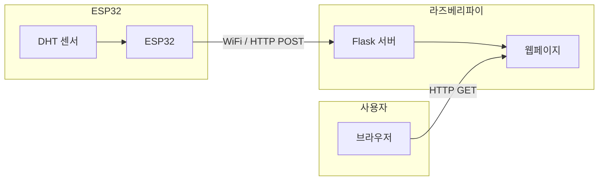
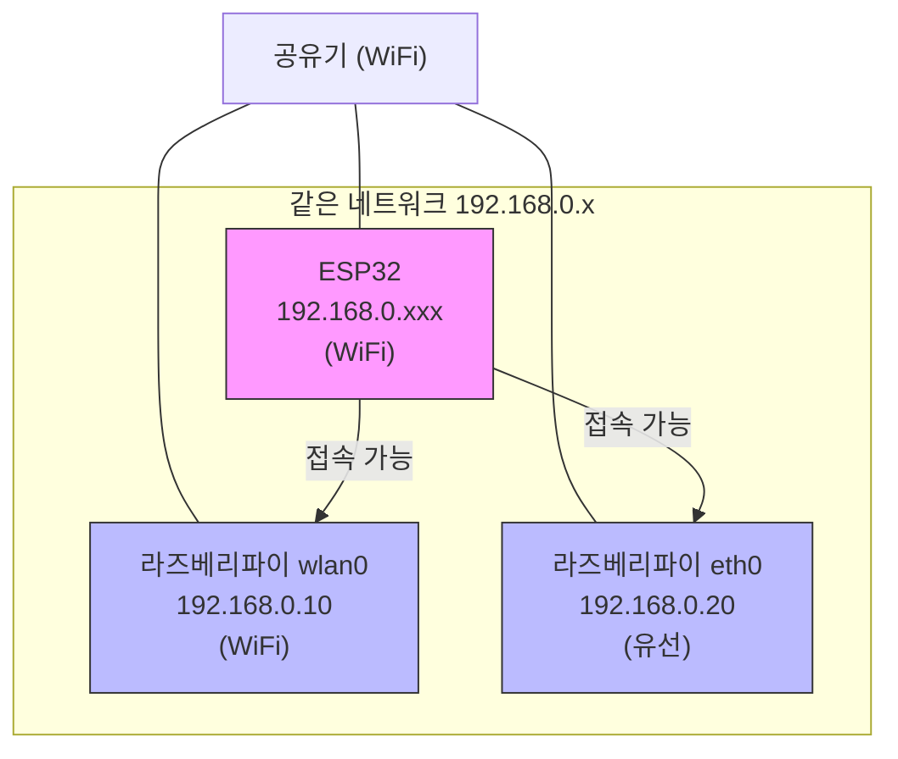
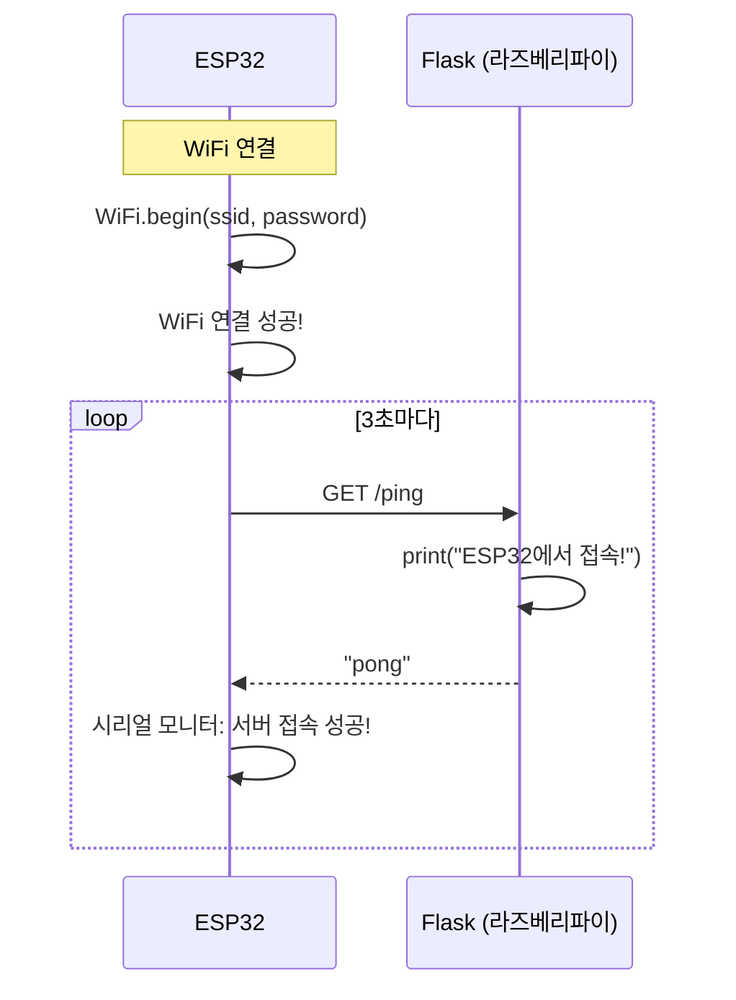
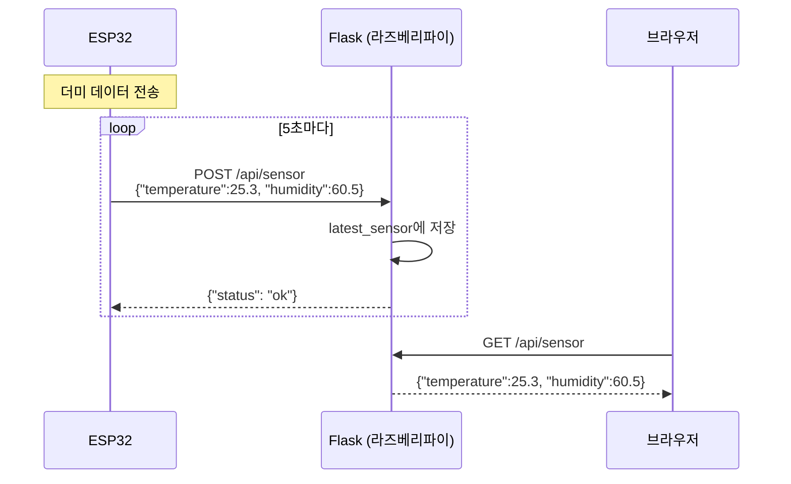
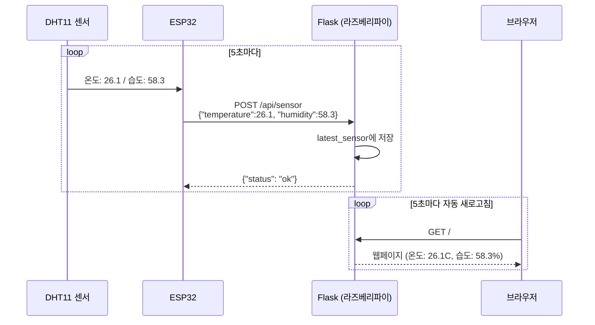
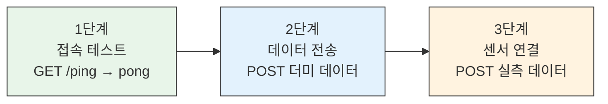

# ESP32 - 라즈베리파이 HTTP 통신 다이어그램

## 전체 구조

---

## 네트워크 구조

> `host='0.0.0.0'`으로 Flask를 실행하면 wlan0, eth0 **둘 다** 접속 가능

---

## 1단계: 접속 테스트 (ping/pong)

---

## 2단계: POST/GET 데이터 전송

---

## 3단계: 센서 데이터 + 웹페이지

---

## 단계별 진행 흐름

